<h1>Лабораторна робота: Знайомство з Docker та розробка Todo застосунку</h1>

Запуск першого тестового Docker контейнера:

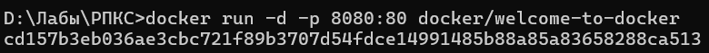

Підтвердження успішного запуску:

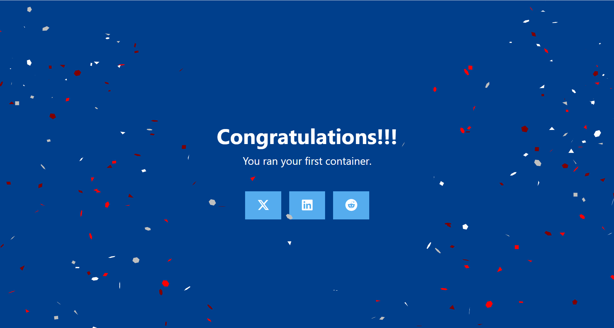

Клонування та розгортання Todo застосунку через Docker Compose:

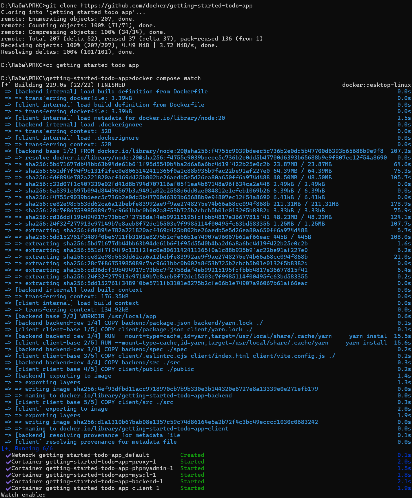

Головний інтерфейс Todo застосунку:

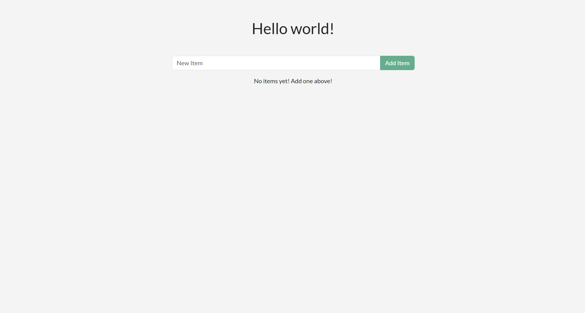

Файл getGreeting.js містить масив морських привітань та функцію, яка випадковим чином обирає одне з них для відображення користувачу:

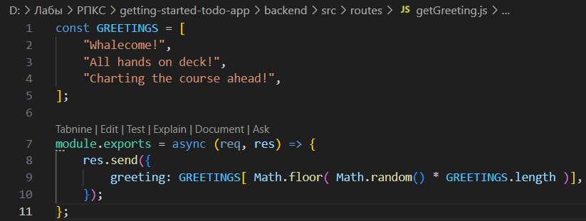

<h1>Лабораторна робота: Розробка інтерфейсу Todo застосунку</h1>

Реалізація інтерфейсу Todo застосунку з випадковими морськими привітаннями:

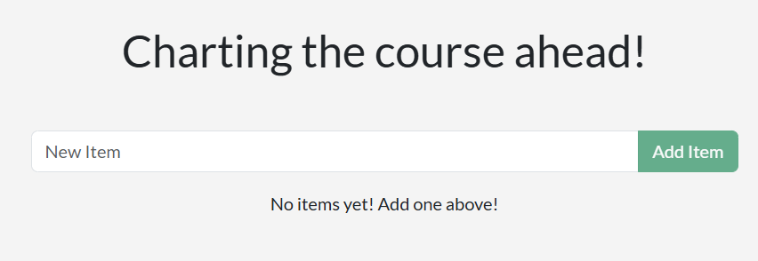

Компонент форми AddItemForm.jsx, що відповідає за додавання нових завдань:

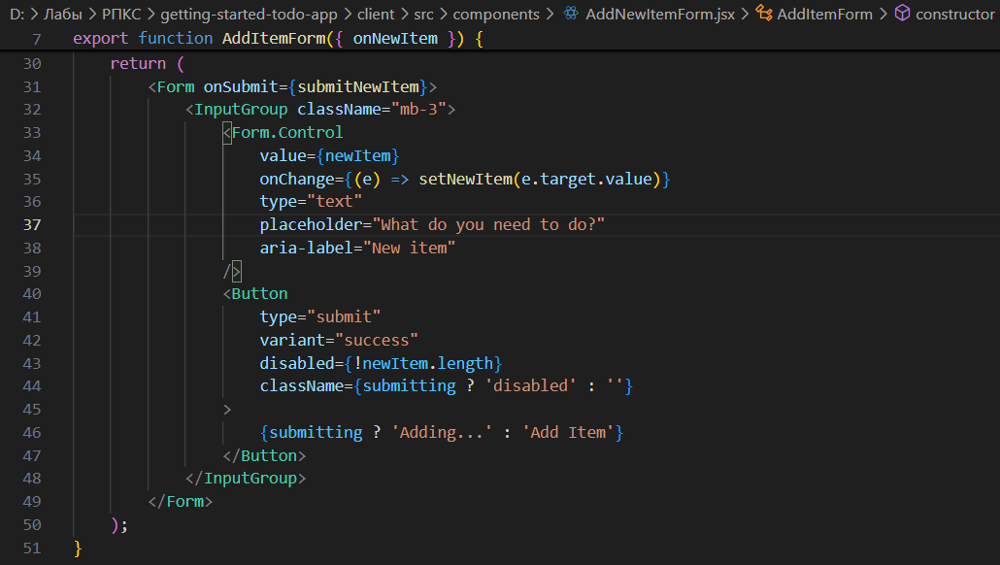

Тестування форми з плейсхолдером "What do you need to do?":

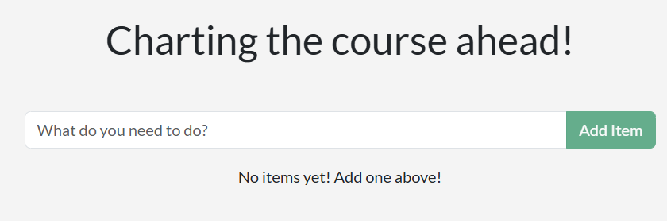

Налаштування стилів у файлі index.scss - підключення Bootstrap та базових стилів:

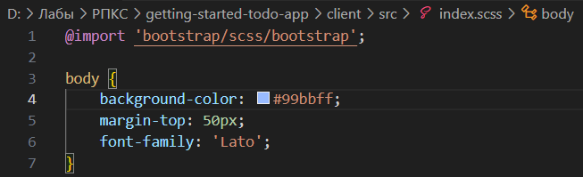

Фінальний вигляд застосунку з застосованими стилями та морською тематикою:

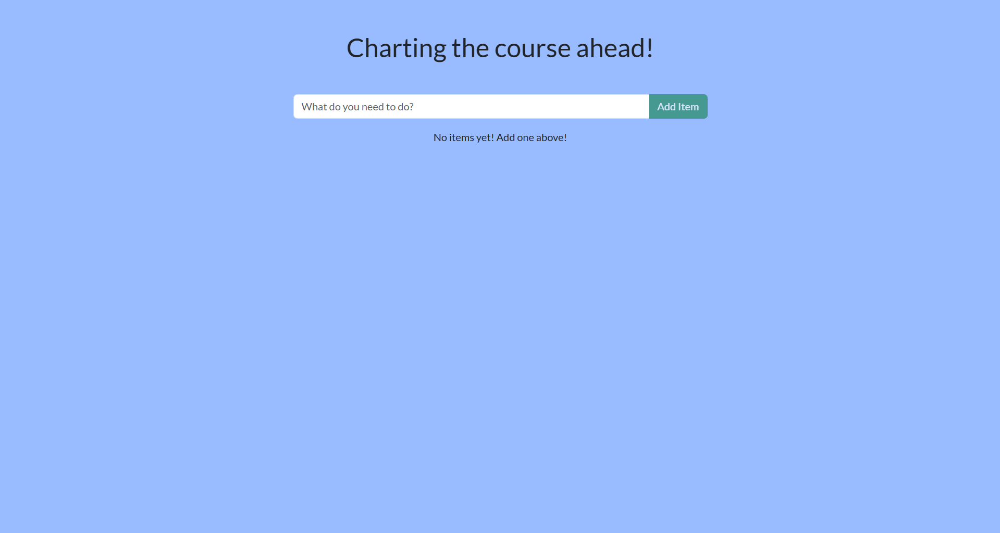

Створення нового репозиторію на Docker Hub для майбутнього розміщення образу:

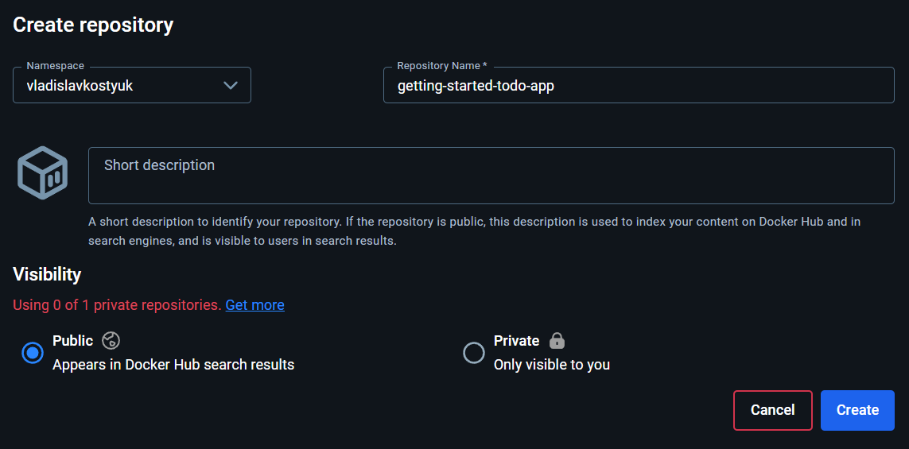

Процес збірки та публікації Docker-образу з застосунком. Використання команд docker build, docker image ls та docker push для створення та завантаження образу в репозиторій:

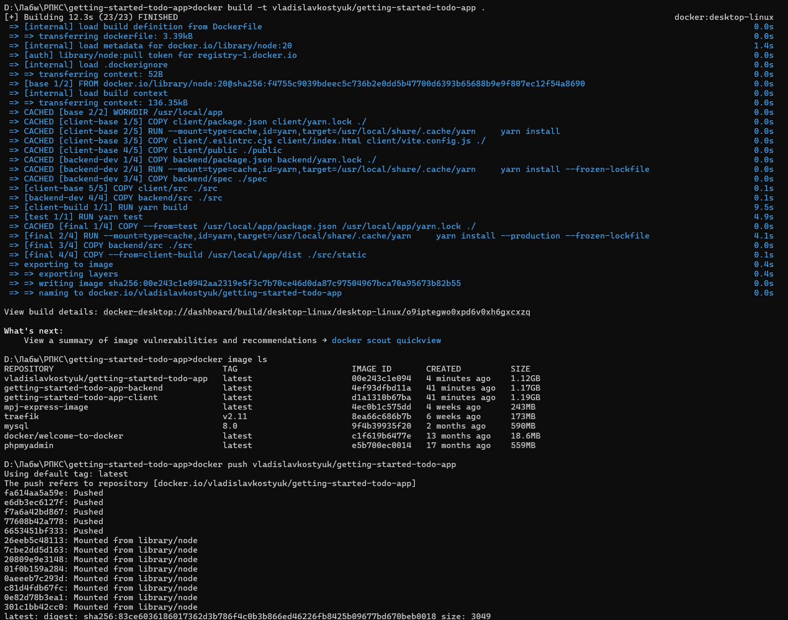

